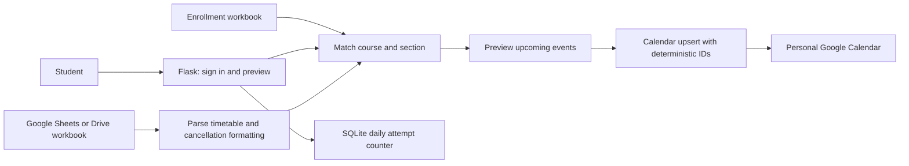

# Campus Calendar Sync

**A student timetable workflow that turns course enrollments and a changing timetable into Google Calendar events.**

Built with Python, Flask, Google OAuth, Sheets/Drive APIs and Calendar API. This public portfolio copy uses fictional student data and configurable file IDs. Institutional rosters and OAuth secrets are excluded.

## The problem

Students need the classes for their own course sections, while the source timetable contains many sections and can change. Manually copying classes into a personal calendar creates repetitive work and risks stale reminders or duplicate events.

## The workflow

1. Sign in with Google and enter a student identifier.
2. Match the student's course and section enrollments.
3. Preview matching upcoming classes from the timetable.
4. Sync events into the signed-in user's primary Google Calendar.
5. Re-sync to update the same events. Explicitly cancelled classes remain visible with a cancellation label and no reminder.

## Try it without a Google account

```bash
python3 -m venv .venv
source .venv/bin/activate
pip install -r requirements.txt
python demo.py
python -m unittest discover -v
```

The offline walkthrough prints calendar payloads for a fictional scheduled class and a cancelled class. It makes no network requests and writes nothing to Google Calendar. The tests exercise cancellation formatting, deterministic IDs, reminders, and mocked update/insert behavior.

## What the implementation demonstrates

| Product concern | Implemented behavior |
|---|---|
| Repeated sync clicks | Deterministic event IDs; update first, insert if missing, resolve insert conflicts |
| Changed cancellation status | Update the event title and disable reminders |
| Timetable freshness vs API quota | Configurable five-minute cache |
| Transient API failures | Retry rate limits and server errors with backoff |
| Student-specific workflow | Match enrollment by course code and section |
| Sync bursts | Per-user in-process lock and daily attempt counter in SQLite |
| Operational visibility | Health endpoint and structured usage logging |

## Architecture



Read [the product case study](PRODUCT_CASE_STUDY.md) for scope, trade-offs, success metrics to measure, and the next improvements. Read [setup and operations](SETUP.md) for OAuth and deployment instructions.

## Honest boundaries

- This is deterministic workflow automation. The repository does not implement an LLM, RAG, embeddings or autonomous AI reasoning.
- The original local project includes Cloud Run deployment instructions and a recorded service URL. This publication checks local behavior; it does not claim a current live service, verified adoption, or measured time savings.
- Offline tests mock Google API behavior. An end-to-end OAuth and Calendar test requires the reader's own Google project and source timetable.
- Time changes change the event ID. The Flask version does not automatically remove the old event after a reschedule, or reconcile a class simply disappearing from the timetable.
- Source formats are specialized: course codes beginning with `26`, section letters, week-labelled tabs and a limited timetable range. See the setup guide before using a different institution's data.
- Calendar events use `Asia/Kolkata`. Future-event filtering currently uses the host's local clock; deployment timezone must match until that logic is improved.
- The local SQLite counter is not durable across Cloud Run instance replacement and is not shared across multiple instances.
- Google OAuth consent and broader deployment permissions need review before wider distribution. Student identification is a convenience match, not a verified authorization boundary.

## Repository map

`app.py`: UI, OAuth and routes · `services.py`: enrollment, parsing and Calendar sync · `sync_tracker.py`: daily attempt counter · `demo.py`: fictional offline walkthrough · `test_services.py` and `test_sync.py`: automated checks · `Dockerfile`: container entry point.
